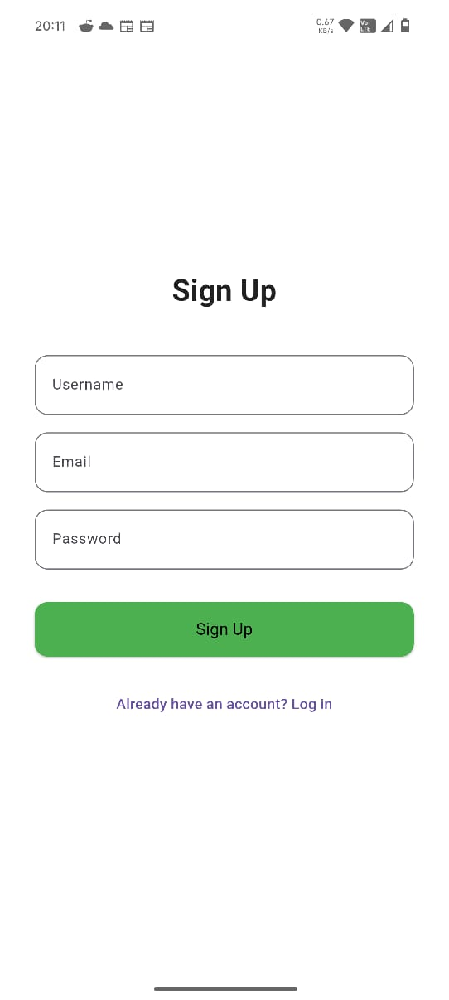
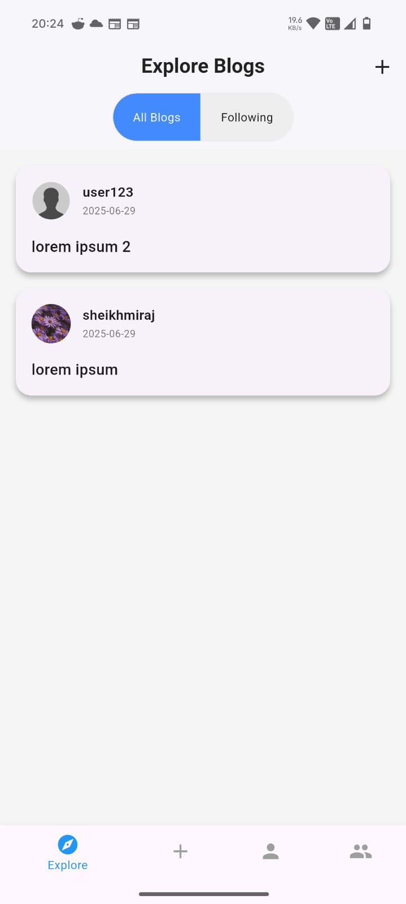
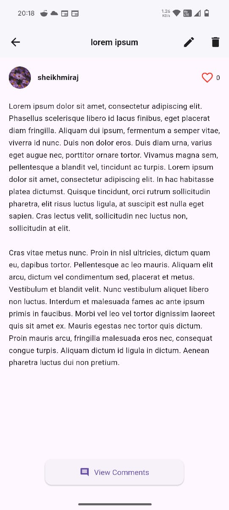
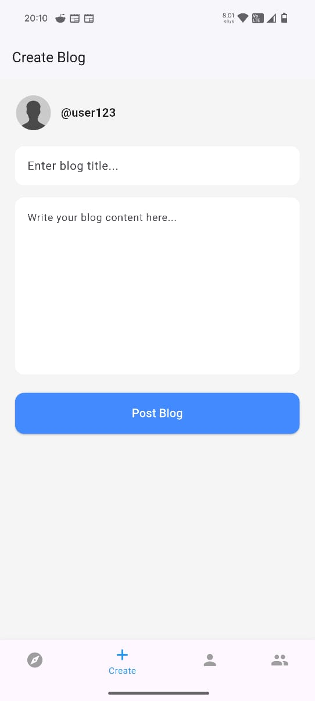
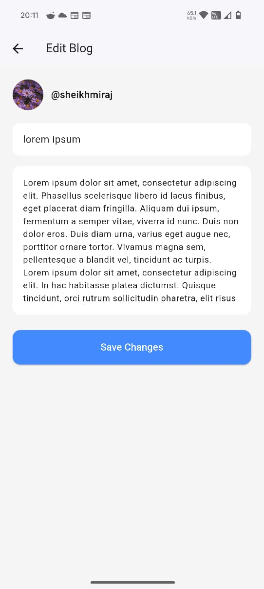
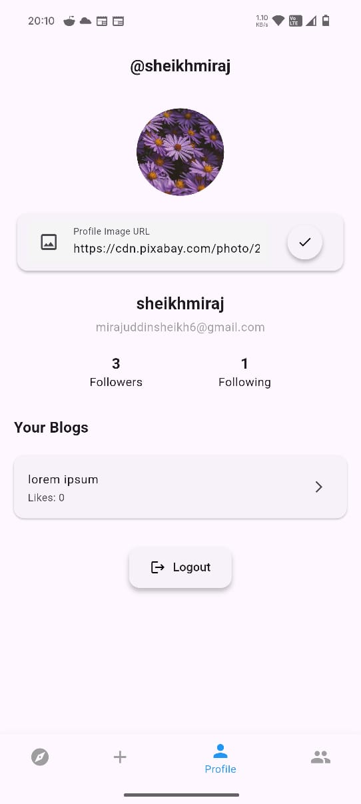
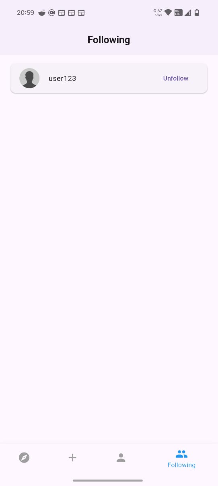
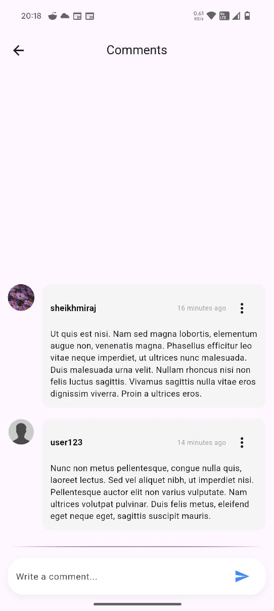

# 📝 Flutter Blog App

A sleek and minimal blog app built using **Flutter** and **Firebase**. Users can sign up, post blogs, comment on other blogs, and interact with others.

---

## 📸 Screenshots


- Login
  <p align="center">
  
  </p>
- Signup
  <p align="center">
  
  </p>
- Explore
  <p align="center">
  
  </p>
- Blog Detail
  <p align="center">
  
  </p>
- Create Blog
  <p align="center">
  
  </p>
- Edit Blog
  <p align="center">
  
  </p>
- Profile Screen
  <p align="center">
  
  </p>
- User Profile Screen
  <p align="center">
  
  </p>
- Following Screen
  <p align="center">
  
  </p>
- Comments
  <p align="center">
  
  </p>


## 🎥 Demo / Screen Recording

- [Watch Demo Video](https://drive.google.com/file/d/1MRH9kc5pP97CGkFJGtQP5ieZ8TuntTOr/view?usp=drivesdk) 

---

## 💡 Core Features

-  **Authentication** — Login & Signup via Firebase Auth  
-  **Blog Management** — Create, edit, and delete blog posts  
-  **Likes** — Like/unlike blog posts with real-time feedback  
-  **Comments** — Add and view comments on blogs  
-  **Profiles** — View author details and your own profile  
-  **Live Updates** — Real-time Firestore data sync  
-  **Responsive UI** — Clean, modern, and adaptive layout  
-  **Provider Architecture** — Scalable and maintainable state management  

---

## 🧾 Firestore Schemas

###  `users` Collection

```json
{
  "uid": "string",
  "username": "string",
  "email": "string",
  "profileImageUrl": "string",
  "bio": "string",
  "createdAt": "timestamp"
}
```

###  `blogs` Collection

```json
{
  "id": "string",
  "title": "string",
  "content": "string",
  "authorId": "string",
  "authorUsername": "string",
  "authorProfileImageUrl": "string",
  "likes": ["uid1", "uid2"],
  "comments": ["commentId1"],
  "createdAt": "timestamp"
}
```

###  `comments` Collection

```json
{
  "id": "string",
  "blogId": "string",
  "userId": "string",
  "username": "string",
  "profileImageUrl": "string",
  "content": "string",
  "createdAt": "timestamp"
}
```

